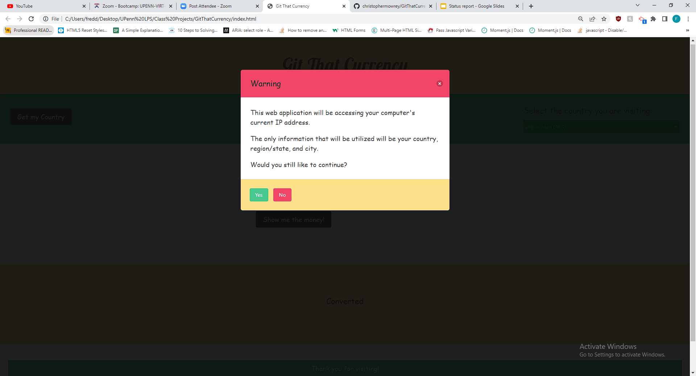
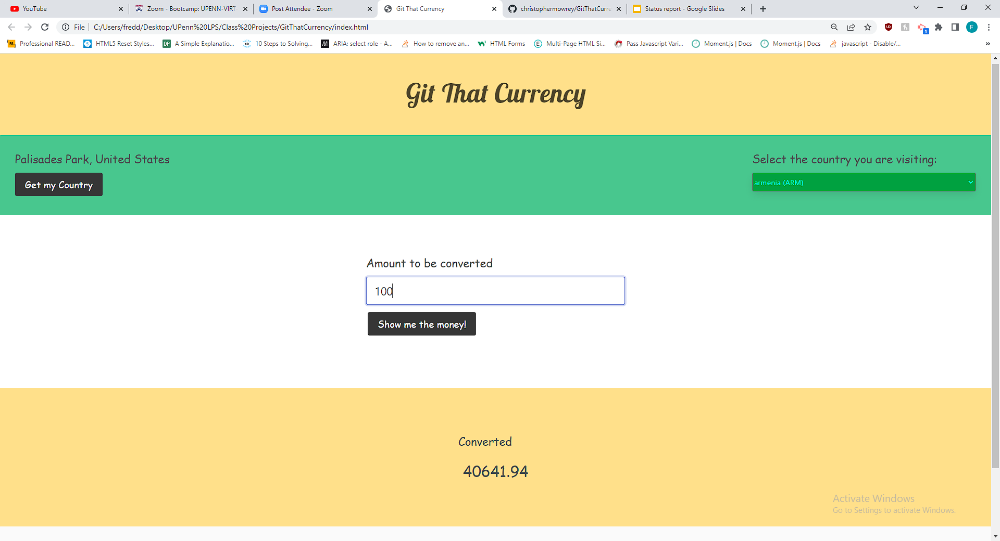

# Git That Currency

## Table of Contents

* [Description](#description)
* [Usage](#usage)
* [Screenshots](#screenshots)
* [APIs Used](#apis-used)
* [All Contributors](#all-contributors)
* [Links](#links)

The goal of the project was to use IP API that can pull the user's current IP address and allow the user to access different country options through a dropdown menu. This information will then allow the user to be able to convert a certain amount of money to the currency that the country of their choosing uses on the website.

DISCLAIMER: It will not actually convert the user's money, but simply determine how much the user's money would be worth in a specific country.

## Usage

* Click "Get my Country" button, which will open the option to allow or deny the application's use of the user's IP address
* If "Yes" is clicked, retrieve the location of user's IP address and display their city and country above the "Get my Country" button
* If "No" or the X button is clicked, return to the home screen.
* Then, select the country you are visiting using the dropdown on the right side of the screen
* Then, enter the amount you want to convert in the text box at the center of the screen
* Then amount should convert, once click "Show Me the Money!" button

## Screenshots

## APIs Used

Abstract IP Geolocation API: "https://www.abstractapi.com/api/ip-geolocation-api"

Currency-API: "https://github.com/fawazahmed0/currency-api"

## All Contributors

Ida Kukimiya: "https://github.com/idakukimiya"

Christopher Mowrey: "https://github.com/christophermowrey"

William J. Hart: "https://github.com/wjimh314"

Freddy Kwak: "https://github.com/fredkk22"

## Links

Deployed URL: "https://christophermowrey.github.io/GitThatCurrency/"

GitHub Repository URL: "https://github.com/christophermowrey/GitThatCurrency"